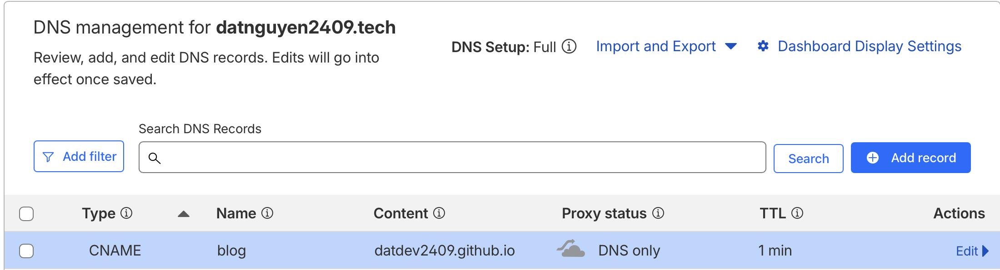
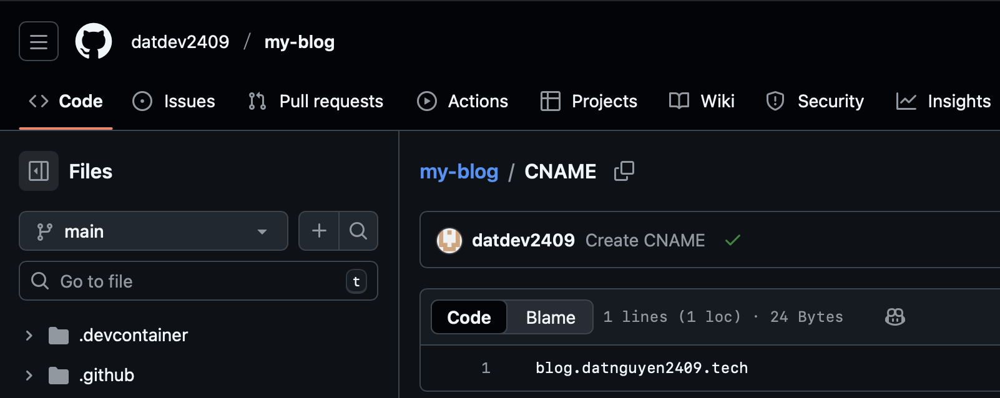
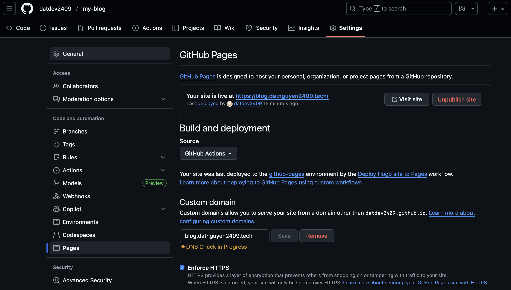

I host my personal blog on GitHub pages (datdev2409/my-blog). The default domain name for my website will be `datdev2409.github.io/my-blog/`. Now I want to create the custom domain name `blog.datnguyen2409.tech` to point to the GitHub pages

{}

## DNS Provider Config

Add the CNAME record point to the `datdev2409.github.io` (replace `datdev2409` with your GitHub username)


The CNAME record should point to the hostname. Not the URL

❌ datdev2409.github.io/my-blog

✅ datdev2409.github.io


I use CloudFlare as the DNS provider. The config looks like below

## GitHub Config

Create the CNAME file with the custom domain name in the root of repository

Go to: Repository -> Settings -> Pages

- Input your custom domain in `Custom Domain` section
- Check `Enforce HTTPS` to enable HTTPS for website

{}
