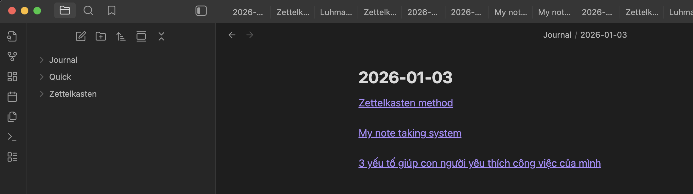

## Why note taking system important?

- Understand the knowledge better. If you can't write about something, you don't understand about the topic

- Resources for creating. Your notes is the best resourecs for creating blog or youtube channels

- References. Quickly find the information when needed

- Sharing. Just send someone the notes

## Thing to consider when choosing the note taking system

- Should be fast, accessible and can search the notes quickly

- AI friendly. The notes should be friendly with AI agent

## My note taking system

I use the [Zettelkasten method](./zettelkasten-method.md). However, in the digial age I don't need to write the note by hand and store it in the wooden drawler, or have the complex ID system to link and search the notes.

Most of note-taking app today, have the feature to link the notes and quickly search the information in the notes. I use Obsidian for my note taking app

In Obsidian app, I have 3 folders

- `Journal` all the daily notes will be created in there
- `Quick` folder contains the fleet notes and literature notes. When I have the new idea or find new information, I will create the new note in quick folder. The fleet and literature notes will be created and link to the daily notes, so I can have the context of the notes.
- `Zettelkasten` folder contains the permanent note. At the end of the date, I review all the notes in `Quick` folder and write the permanent notes.
